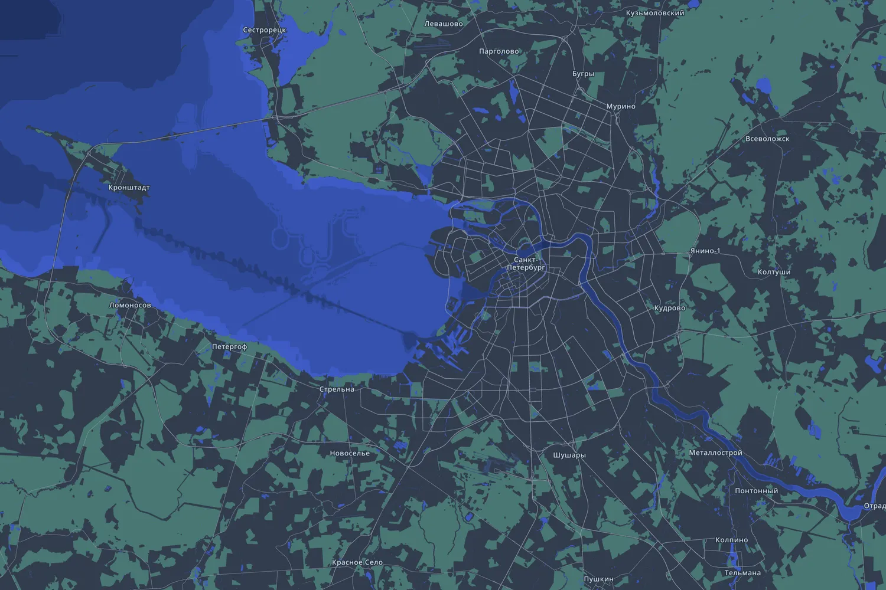

# Санкт-Петербург для Subway Builder

Петербург с агломерацией: 5 887 км² от Кронштадта и Петергофа на западе до
Всеволожска и Гатчины на востоке, 6,8 миллиона жителей и дельта, которая
решает, где вам дадут копать.

В Петербурге шесть линий и около семидесяти станций на пять миллионов человек.
Все здесь сходятся на том, что это мало: бо́льшую часть сети распланировали ещё
в восьмидесятые и так и не построили. Это мой родной город, и перенести его в
Subway Builder я хотел с первого запуска. Хотелось сделать её настолько
достоверной, насколько выйдет: где на самом деле спрос, какая на самом деле
глубина Невы и чего стоит её перейти.

*[In English](README.md)*

## Установка

Через [Railyard](https://github.com/Subway-Builder-Modded), менеджер модов:
найдите **Санкт-Петербург (Saint Petersburg)** в каталоге и поставьте.

Вручную: скачайте `SPB-0.14.0.zip` из [релизов](../../releases), распакуйте,
положите `SPB.pmtiles` в игровой каталог `tiles/`, остальное — в
`cities/data/SPB/`.

## Что внутри

| | |
|---|---|
| Игровая площадь | 5 887 км² (73 × 81 км) |
| Округов | 283 муниципальных образования |
| Жителей | 6 790 069 |
| Рабочих мест | 2 773 251 |
| Точек спроса | 30 815 |
| Связок спроса | 152 778, из них 121 967 дом-работа |
| Зданий | 954 473 |
| Медианная поездка | 16,3 мин / 9,4 км при 35 км/ч |

В кадр попали Кронштадт, Петергоф, Ломоносов, Сестрорецк, Зеленогорск, Пушкин,
Павловск, Колпино, Гатчина, Всеволожск, Мурино, Кудрово, Сертолово, Токсово.

## Спрос

Жители берутся из БД муниципальных показателей Росстата и разносятся по 210 660
зданиям: по числу квартир там, где оно есть в OSM, по площади и типу здания во
всех остальных случаях. Рабочие места — из той же базы, со взвешиванием по
отраслевому профилю. Матрица корреспонденций — гравитационная модель,
сбалансированная по итогам переписи 2020 года.

Сверх этого — 2 150 точек притяжения на 1,39 миллиона поездок в сутки:

| | точек | в сутки |
|---|---:|---:|
| Школы | 1 177 | 644 625 |
| Вузы | 214 | 220 995 |
| Парки | 244 | 99 990 |
| Музеи | 33 | 74 700 |
| Больницы | 135 | 64 845 |
| Аэропорт Пулково | 1 | 60 120 |
| Вокзалы | 5 | 58 500 |
| Торговые центры | 11 | 51 795 |
| Театры и концертные залы | 71 | 36 990 |
| Библиотеки, памятники, храмы, спорт | 259 | 73 935 |
| **Итого** | **2 150** | **1 386 495** |

Спрос в игре статический, времени суток и месяца в нём нет, поэтому карте
приходится выбрать день. Выбран **будний день второй половины сентября**: вузы
и школы учатся, туризм ещё высокий, дачный сезон закончился. Среднее по году
описывало бы день, которого не бывает.

Пять вокзалов стоит отметить отдельно. В словаре спецспроса у реестра
категории для железной дороги нет, поэтому они заведены обычными внешними
точками, а для Петербурга они решают многое: Балтийский — второй по загрузке
вокзал города, и дальних поездов на нём нет вовсе, одна пригородная
электричка.

## Как это проверялось

Каждый слой собран по одному официальному источнику и сверен с другим, чтобы
ошибка в источнике не подтверждала сама себя.

| слой | проверка | результат |
|---|---|---|
| Расселение | суммы по районам против Петростата | 5 689 116 в модели против 5 652 922 опубликованных |
| Расселение | человек на квартиру, 3 616 домов с `building:flats` | 2,10 при размере домохозяйства ~2,1 |
| Рабочие места | всего в границах города | 2 536 953 против 2 561 555 по переписи 2020 |
| Рабочие места | мест на занятого жителя | 1,01 против 1,03 по переписи |
| Матрица | поток из области в город | 191 737 против 154 675 по переписи |
| Маршруты | медианная скорость дверь-в-дверь | 35 км/ч против 33 у ванильного Парижа |

Превышение по матрице объяснимо. Перепись 2020 года, а население здесь на
2025-й, и за эти годы Мурино выросло с 74 до 117 тысяч, а Кудрово почти вдвое.

## Карта

Петербург стоит на воде, поэтому вода посчитана, а не оставлена на заглушке.
Нева у Литейного моста — 24 метра, Зимняя канавка — два, фарватеры Невской губы
режут трёхметровую отмель каналами в тринадцать метров. Тоннель под руслом и
тоннель под каналом поэтому стоят по-разному.

Высоты берутся из тега `height` в OSM, иначе из `building:levels` по
замеренным 3,88 метра на этаж, иначе по ближайшим соседям, у которых есть
хоть одно из двух. На 6 463 зданиях с замеренной высотой, скрытых от модели,
средняя ошибка — 3,8 метра против 11,6 у плоской заглушки.

Объёмы ступенчатые: 21 126 полигонов `building:part` лежат поверх контуров,
поэтому Исаакий — это купол на 18 метрах и крест на 102, а не стометровая
стена. Лахта-центр, телебашня, шпиль Петропавловки и «Газпром Арена»
поставлены руками.

## Источники и лицензии

Все источники, по которым собрана карта, с адресами и лицензиями перечислены в
[ATTRIBUTION.ru.md](ATTRIBUTION.ru.md).

Картографические данные © участники OpenStreetMap, ODbL 1.0. Рельеф дна — GEBCO
2026. Население и занятость — Росстат, ВПН-2020, Петростат.

## Авторство

Карта — **SindieFox**, собрана с помощью
[depot](https://github.com/Subway-Builder-Modded).
